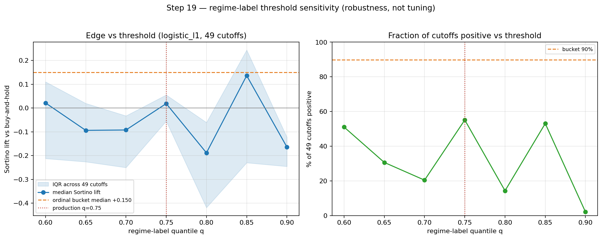

# CHECKPOINT — Step 19: regime-label threshold sensitivity

**Generated:** 2026-06-18 13:56 UTC

## Question
Is the regime-label threshold q=0.75 (top-quartile turbulence → 'turbulent') optimal — i.e. does the supervised edge depend on it?

## Method (robustness, not optimisation)
Swept q ∈ [0.6, 0.65, 0.7, 0.75, 0.8, 0.85, 0.9]; at each q, rebuilt the binary regime feature and the full feature matrix, then ran the 49-cutoff sliding test for `logistic_l1`. The prediction target (90th dev-pct turbulence within 21d) is held FIXED, isolating the feature-threshold effect. We report the distribution at each q — never an argmax-q (that would be the look-ahead error the test exists to catch).

## Result

|    q |   median |    q25 |    q75 |   frac_positive |   max |
|-----:|---------:|-------:|-------:|----------------:|------:|
| 0.6  |    0.021 | -0.212 |  0.11  |           0.51  | 0.288 |
| 0.65 |   -0.094 | -0.226 |  0.02  |           0.306 | 0.308 |
| 0.7  |   -0.092 | -0.25  | -0.033 |           0.204 | 0.307 |
| 0.75 |    0.019 | -0.055 |  0.055 |           0.551 | 0.191 |
| 0.8  |   -0.188 | -0.419 | -0.061 |           0.143 | 0.233 |
| 0.85 |    0.136 | -0.23  |  0.244 |           0.531 | 0.369 |
| 0.9  |   -0.164 | -0.246 | -0.123 |           0.02  | 0.005 |

Reference — ordinal bucket (step12, replaces the single threshold): median +0.150, frac positive 90%.

## Verdict

**NO OPTIMAL THRESHOLD — the binary cut is a noisy feature.** The median lift is **non-monotonic** in q (Spearman ρ = -0.25, sign flips 5× across the grid) and every value sits inside the wide per-cutoff IQR. There is no systematic 'best' q; the 0.32 spread is the sample-size ceiling, not real threshold dependence — so 0.75 is neither special nor a tuned hyperparameter. **Decisively, the ordinal bucket beats *every* single threshold** (median +0.150 vs best-single +0.136; 90% positive vs best-single 55%). Conclusion: don't tune the threshold — use the bucket (step12).

## Interpretation
- The binary regime label is a minor feature (Phase-7 ablation L1: it adds ~0.026 Sortino, inside the noise floor), so a flat curve here is expected and reassuring — there is no hidden tuned threshold.
- The honest answer to 'is 0.75 optimal?' is that **we no longer depend on a single threshold**: the ordinal bucket (step12) uses the full severity gradient and is the recommended representation.

## Caveats
- Same ~1,327-row OOS ceiling: differences below ~0.5 Sortino are noise; read the curve as a robustness band, not a ranking.
- `logistic_l1` only (the linear model the regime feature feeds). The random forest bins turbulence internally and is even less threshold-sensitive.