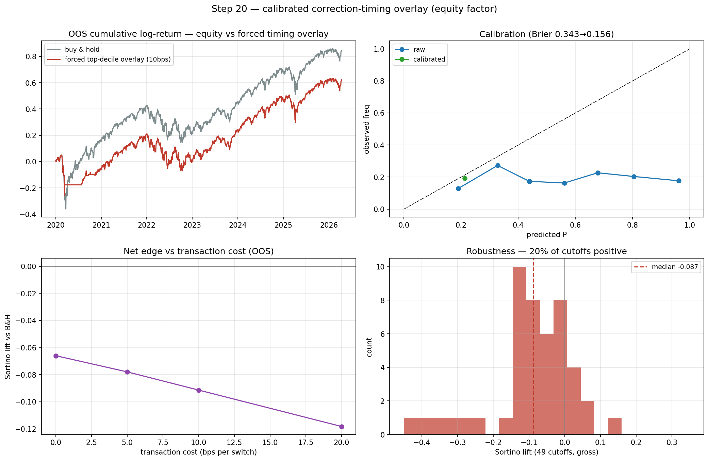

# CHECKPOINT — Step 20: calibrated correction-timing overlay

**Generated:** 2026-08-02 11:02 UTC

## What was built
A deployable overlay on the **equity factor**: predict P(loss ≥ X% over 21d), isotonic-calibrate on dev, go to cash when P ≥ τ (τ dev-selected), charge transaction costs, evaluate vs buy-and-hold and across 49 cutoffs. Probabilities are quarterly walk-forward; calibrator and τ use dev data only.

## Per-target results (OOS 2020+, headline cost 10bps)

| loss   |   base_rate |   auc |   brier_raw |   brier_cal |   tau |   lift_devtau |   in_cash_devtau |   lift_forced_decile |   false_alarm_forced |   maxdd_forced |   maxdd_bh |
|:-------|------------:|------:|------------:|------------:|------:|--------------:|-----------------:|---------------------:|---------------------:|---------------:|-----------:|
| 2%     |       0.466 | 0.532 |       0.28  |       0.248 |  0.46 |             0 |                0 |               -0.016 |                0.572 |         -0.294 |     -0.411 |
| 5%     |       0.193 | 0.482 |       0.343 |       0.156 |  0.22 |             0 |                0 |               -0.091 |                0.56  |         -0.308 |     -0.411 |

**49-cutoff robustness (5% target, gross):** median -0.087, IQR [-0.129, -0.009], 20% of cutoffs positive.

**Transaction-cost sweep (5%, Sortino lift):** 0bps→-0.066, 5bps→-0.078, 10bps→-0.091, 20bps→-0.118.

## Verdict

**NO ROBUST CALENDAR-TIME EDGE — but a clean, honest result.** Three things, in order:

1. **The signal is weak for *equity corrections* specifically.** OOS AUC for the 5% target is **0.482** (≈ chance), vs ≈0.66 for the turbulence-entry target (step06). *Turbulence predicts turbulence far better than it predicts equity drawdowns* — the timing ask is genuinely harder than the task the project had been solving.

2. **Calibration works and is worth keeping.** Isotonic (dev-fit) cuts the 5% Brier from 0.343 to 0.156 — the probabilities become usable even though the ranking is weak.

3. **Acting on the signal doesn't beat buy-and-hold.** The dev-selected absolute-probability policy degenerates to *stay invested* (the model is never confident enough about a 5% correction to justify cash given costs); forcing a go-to-cash on the top-decile most-stressed days gives net Sortino lift -0.091; and across 49 cutoffs the gross edge has median -0.087 (20% positive). All inside the noise floor.

**This is the expected, well-evidenced answer under the sample-size ceiling — and it sharpens the case for the next step: event-time (step 21), where the drawdown target may be better-posed.**

## Notes
- Calibration is leak-free (isotonic fit on dev walk-forward predictions, applied to OOS); reliability diagram + Brier before/after in the figure.
- τ is dev-selected to max dev Sortino — a dev decision, not OOS tuning.
- 1% was excluded as a target: it fires on near-daily noise. 2% and 5% are reported; 5% is a genuine correction.
- Same OOS ceiling: read the 49-cutoff distribution, not the single net number. **Next: step 21 repeats this on the event clock.**