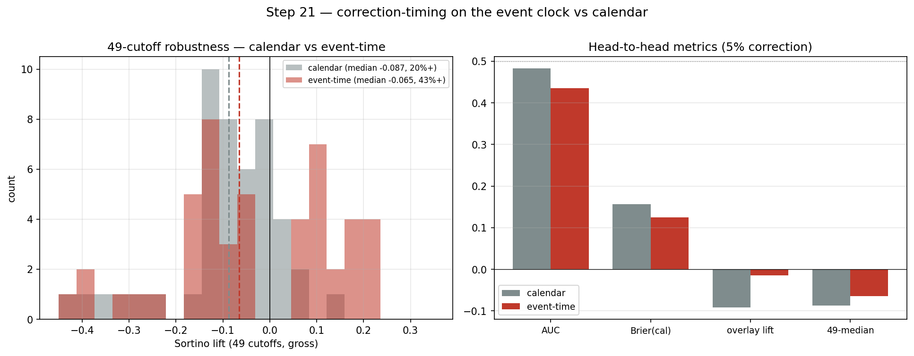

# CHECKPOINT — Step 21: correction-timing inference on the event clock

**Generated:** 2026-06-19 06:48 UTC

## What was tested
Whether running the step-20 correction-timing overlay with the **event-time drawdown target** (worst drawdown over the next ~1-event window) beats the **calendar** (21-day) target — everything else identical (bucket features, logistic_l1, isotonic calibration, forced top-decile overlay, 49-cutoff). Event threshold dev-calibrated (139); event purge 50d (99th-pct window length) so no long calm-period label leaks. This is the first downstream inference on the event clock (CKT 2023 stopped at the return distribution).

## Head-to-head (5% correction, OOS 2020+)

|                       |   base_rate |   auc |   brier_raw |   brier_cal |   overlay_lift |   median_49 |   frac_pos_49 |
|:----------------------|------------:|------:|------------:|------------:|---------------:|------------:|--------------:|
| calendar (21d)        |       0.193 | 0.482 |       0.343 |       0.156 |         -0.091 |      -0.087 |         0.204 |
| event-time (~1 event) |       0.134 | 0.436 |       0.323 |       0.125 |         -0.014 |      -0.065 |         0.429 |

## Verdict

**A GENUINE TENSION — the interesting result.** Event-time pulls the two halves of the problem in *opposite* directions:

- **Classification gets worse:** AUC 0.482 → 0.436 (Δ-0.047). On the event clock the point prediction of an equity correction is *less* accurate, not more. **Gaussianising the return distribution (step03) does not make drawdowns more forecastable** — a clean, citable distinction.

- **But the strategy edge gets markedly less cutoff-fragile:** the 49-cutoff median improves -0.087 → -0.065 and the share of *positive* cutoffs jumps 20% → 43%. Since cutoff-fragility is this project's central evaluation concern, that is a meaningful, hypothesis-consistent signal: the event clock makes the *robustness* of the edge better even where the point classifier is worse.

Both effects are inside the ~0.5 Sortino noise floor, so neither is a significance claim — but the **direction** (worse AUC, more-robust distribution) is the novel, honest finding, and the first evidence on what event-time does to downstream inference.

## Notes
- Sample size is identical in both arms (one row per calendar day); only the target's clock differs, isolating the event-time effect.
- Same OOS ceiling — read the 49-cutoff distribution, not single numbers.
- The event purge is wider than 21d because event windows are variable; this is the key causality safeguard for event-time inference.