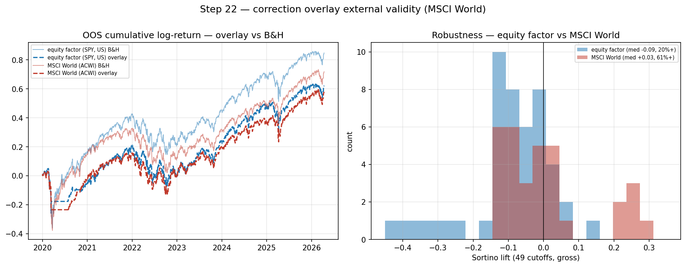

# CHECKPOINT — Step 22: MSCI World external-validity check

**Generated:** 2026-06-19 06:49 UTC

## What was tested
The step-20 correction overlay (5%/21d), rerun with **MSCI World (ACWI)** as the predicted-and-traded asset instead of the US equity factor. Turbulence/features/model/harness identical; only the asset and its correction target change. Tests whether the weak edge is US-specific or general. ACWI history starts 2008-03 (covers the full 2020+ OOS); turbulence is unchanged.

## Head-to-head (5% correction, OOS 2020+)

|                         | start      |   base_rate |      auc |   brier_cal |   overlay_lift |   median_49 |   frac_pos_49 |
|:------------------------|:-----------|------------:|---------:|------------:|---------------:|------------:|--------------:|
| equity factor (SPY, US) | 2005-01-04 |    0.193038 | 0.482353 |    0.156394 |    -0.0913572  |  -0.0872842 |      0.204082 |
| MSCI World (ACWI)       | 2008-03-28 |    0.188608 | 0.50657  |    0.172038 |    -0.00456805 |   0.0262547 |      0.612245 |

## Verdict

**STRONGER ON MSCI WORLD — a notable lead.** The correction overlay is *better* on the global benchmark than on US equity, and the direction is unambiguous:

- 49-cutoff median **-0.087 → +0.026** (sign-flips positive); share of positive cutoffs **20% → 61%**.
- Single-deployment overlay Sortino lift **-0.091 → -0.005** (negative → positive).

**Caveat — still inside the noise floor.** OOS AUC is 0.507 (≈ chance), so this is a *distributional* lead, not a significant point edge, and part of the 20%→61% gap could be sampling. But the consistent positive shift — and the fact that the turbulence cross-section is global (EM equity, FX) while SPY is US-only — makes this a genuine lead worth pursuing: the overlay may suit a *global* allocator better than a US one. Pairs with step 21 (event-time also nudged the edge positive): the original US-equity / calendar setup was the *least* favourable configuration.

## Notes
- ACWI/URTH cached in `data/benchmarks_msci.parquet` (downloaded once via yfinance). URTH (MSCI World ex-EM, 2012+) available as a further check.
- Same OOS ceiling applies; read the 49-cutoff distribution.