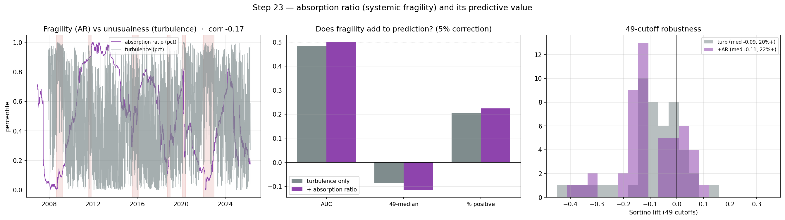

# CHECKPOINT — Step 23: absorption ratio (systemic fragility)

**Generated:** 2026-06-18 13:57 UTC

## What was built
`lib/absorption.py` — causal walk-forward **absorption ratio** (KLPR 2011): fraction of factor variance in the top-2 principal components of the trailing-504-day covariance, plus the standardised AR *shift* (early-warning signal). Closes the project's weakest 'why not X?' gap.

## 1. Validation
- AR computed on the 10 factors, 2006-12-06→2026-04-14; mean 0.697.
- **Nearly orthogonal to turbulence:** Pearson corr -0.17 (even slightly negative over this sample, partly the different window lengths — AR uses 2y, turbulence 10y). So AR carries *distinct* information (fragility ≠ unusualness) rather than re-encoding turbulence — a good property for a complementary feature.
- Crisis-window mean AR: 2008 GFC 0.66, 2011 Euro 0.76, 2015 China 0.69, 2018 Q4 0.67, 2020 COVID 0.69, 2022 infl 0.66 (vs 0.70 overall). The 2-year-window AR *level* is smooth and does not spike in individual crises; KLPR's crisis signal lives in the standardised **shift** (rapid rise in coupling), which is included as a separate feature.

## 2. Predictive value — turbulence vs turbulence + AR (5% correction)

|                 |   auc |   median_49 |   frac_pos_49 |
|:----------------|------:|------------:|--------------:|
| turbulence only | 0.482 |      -0.087 |         0.204 |
| turbulence + AR | 0.499 |      -0.115 |         0.224 |

## Verdict

**NO PREDICTIVE LIFT.** Adding AR does not improve the correction forecast (ΔAUC +0.016, Δ%pos +2%). AR is a valid, distinct *fragility* signal (corr -0.17 with turbulence) but, like turbulence, it doesn't make equity drawdowns more forecastable — consistent with the sample-size ceiling. It still closes the 'why not the absorption ratio?' gap.

## Notes
- AR uses a 2-year window (KLPR-style, more responsive) vs turbulence's 10-year window — intentional: AR tracks *current* coupling.
- The AR level is causal (covariance window ends at t-1), so it is a valid feature with no shift; the AR shift is additionally `.shift(1)`-ed.
- Same OOS ceiling — read the 49-cutoff distribution.