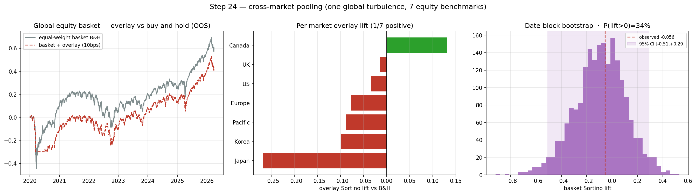

# CHECKPOINT — Step 24: cross-market pooling

**Generated:** 2026-06-19 06:50 UTC

## What was built
One **global** Factor-Lens turbulence signal (unchanged) applied to a panel of **7 regional equity benchmarks** (US, Europe, Japan, UK, Pacific, Canada, Korea), pooled into a single logistic_l1 with **market fixed effects**, quarterly walk-forward. Honest inference via a **date-block bootstrap** (resamples whole dates → preserves cross-market co-movement). The Factor Lens is not diverged from — there is no per-market turbulence; the global signal is tested across markets.

## Result (OOS 2020+, 5% correction, equal-weight basket, 10bps)

- **Pooled model AUC:** 0.570 (across 28,742 market-date rows).
- **Basket overlay Sortino lift:** -0.056; date-block-bootstrap 95% CI **[-0.509, +0.293]**, P(lift>0) = 34%.
- **1/7 markets** have a positive overlay lift.

|         |   auc |   lift |   maxdd_strat |   maxdd_bh |
|:--------|------:|-------:|--------------:|-----------:|
| US      | 0.518 | -0.034 |        -0.309 |     -0.411 |
| Europe  | 0.586 | -0.077 |        -0.345 |     -0.464 |
| Japan   | 0.485 | -0.268 |        -0.411 |     -0.403 |
| UK      | 0.646 | -0.015 |        -0.393 |     -0.552 |
| Pacific | 0.533 | -0.089 |        -0.347 |     -0.499 |
| Canada  | 0.591 |  0.13  |        -0.311 |     -0.556 |
| Korea   | 0.459 | -0.099 |        -0.647 |     -0.688 |

## Verdict

**NO POOLED EDGE.** Basket lift -0.056, CI [-0.509, +0.293], 1/7 markets positive. Pooling does not surface a robust correction-timing edge; the weak signal is consistent across markets, not a US artefact. The value is the honest multi-market test and the validated panel framework (Factor Lens intact).

## Why this respects the Factor-Lens requirements
- **One global signal**, not per-market turbulence — the lens is intact and its universality is *tested* across geographies.
- **Interpretable/systematic:** a single logistic_l1 + market dummies (a panel regression), applied uniformly; every prediction is traceable.
- **Honest power accounting:** the date-block bootstrap respects that markets co-move, so the effective sample gain (and any significance) is not overstated.

## Notes
- Regional ETFs (VGK/EWJ/EWU/EPP/EWC/EWY, 2007+) cached in `data/benchmarks_regional.parquet`. US = the equity factor.
- Next lever if more power is needed: add sectors / more regions, or combine with the event clock (step 21).