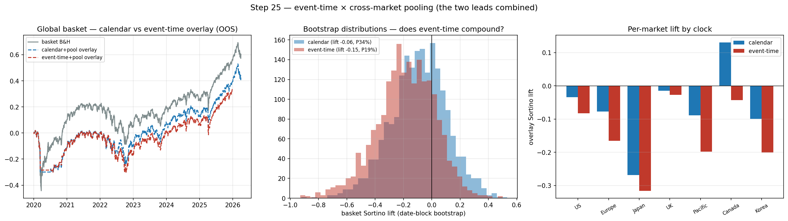

# CHECKPOINT — Step 25: event-time × cross-market pooling (combining the leads)

**Generated:** 2026-06-19 06:51 UTC

## What was tested
The step-24 pooled overlay (one global turbulence, 7 markets, market fixed effects, panel walk-forward, date-block bootstrap) with each market's target on the **event clock** (event-time drawdown) vs the **calendar** 21-day drawdown. Tests whether the two confirmed leads — the event clock (step 21) and pooling (step 24) — compound. Event threshold 139 (dev-calibrated); event purge 50d.

## Head-to-head (equal-weight global basket, 5% correction, 10bps)

|                      |   auc |   basket_lift |   ci_low |   ci_high |   p_pos |   markets_pos |
|:---------------------|------:|--------------:|---------:|----------:|--------:|--------------:|
| calendar + pooling   | 0.57  |        -0.056 |   -0.509 |     0.293 |   0.335 |             1 |
| event-time + pooling | 0.536 |        -0.146 |   -0.633 |     0.186 |   0.188 |             0 |

## Verdict

**THE LEADS CONFLICT — a clean, mechanistically-clear null.** Event-time + pooling is *worse*, not better: basket lift -0.146 (0/7 markets positive, P>0=19%) vs calendar + pooling -0.056 (1/7, P>0=34%). The two confirmed leads don't stack — they collide.

**Why (and it's instructive):** the event clock is derived from the *global* factor turbulence, so using it as the target horizon imposes one global stress-clock on *heterogeneous local* markets (Korea, Japan, Canada…) whose own drawdown dynamics don't follow it. Event-time's benefit in step 21 was specific to the matched-clock single-asset case — the US equity factor, whose drawdowns roughly track the global clock. Across diverse local markets the global event window is a *mismatched* target horizon.

**Conclusion: pooling is the lever that works; the event clock does not transfer to a cross-market pooled setting.** Calendar + pooling (step 24) remains the best configuration. Honest negative — and it sharpens *why* step 24 works: a market-agnostic horizon pools cleanly; a global event horizon does not.

## Notes
- Both arms use identical features/model/markets — only the target's clock (and the matched walk-forward purge) differ.
- 95% CI from a date-block bootstrap (21-day blocks) that preserves cross-market co-movement — significance is not overstated.
- Factor Lens intact (one global signal); interpretable/systematic/transparent.